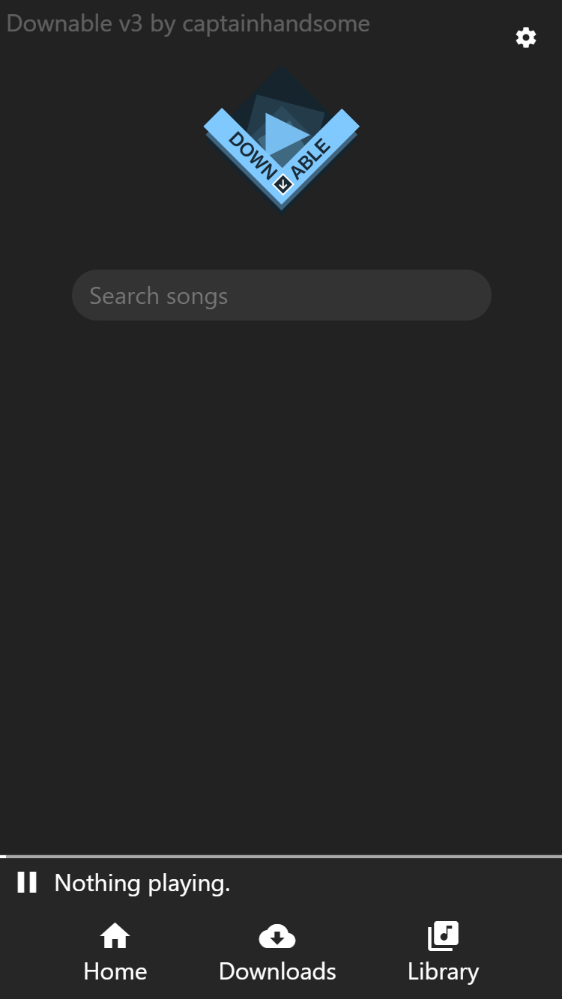
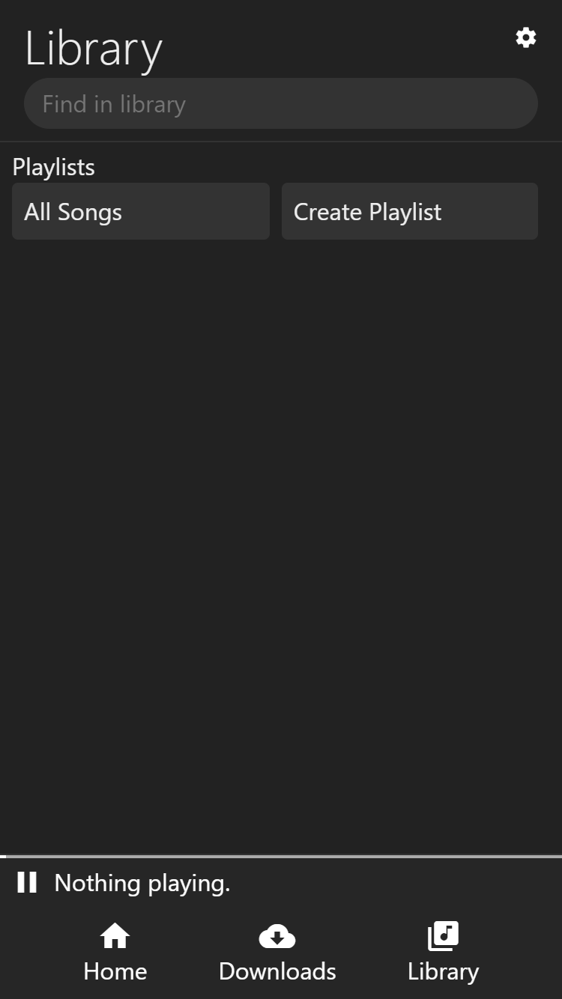
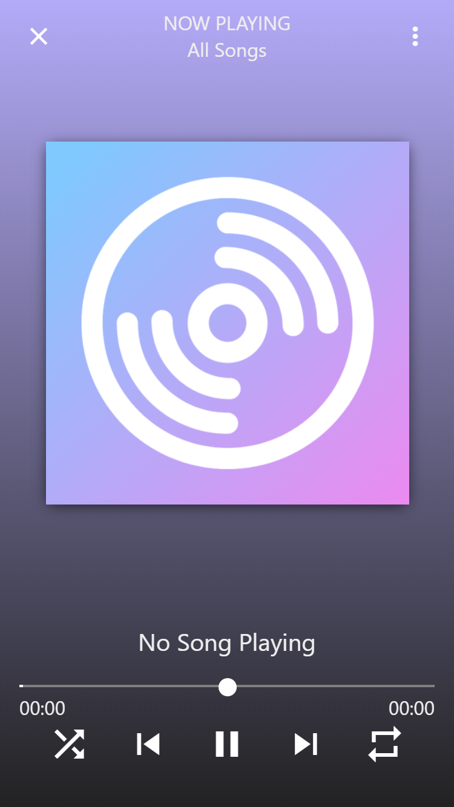

# downable-webapp-frontend
Downable webapp is a music player and youtube downloader combined. One of my old projects.

Should be Pure JS, but my downloaded boilerplate has jQuery, so I am working towards removing that dependency.

Is a PWA, but chrome disabled .appcache, which sucks. Can be used offline.

Uses PouchDB for offline song storage.

The API backend will be uploaded in some point of time. 

# Home

# Library

# Now Playing

